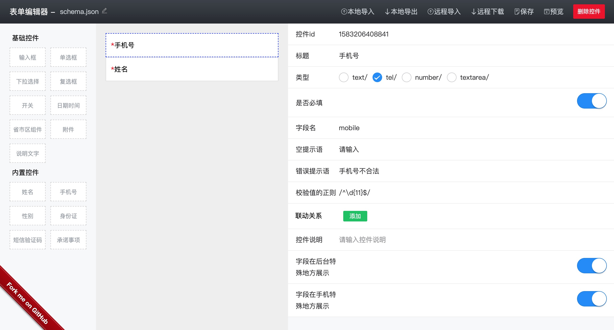

# vant-form

基于 vant 封装的可视化表单系统

### demo



### 安装

```
# 依赖 tcon 样式
npm i vant-form tcon --save
```

### 使用

流程

- 在[后台](https://iming.work/demo/vant-form/dist/index.html#/editor)配置需要的字段，点击保存，下载到项目中
- 在项目中安装 Render 组件，按照以下方式使用即可

> 方式一：组件引入

```vue
<template>
  <vant-form 
    :schema="schema"
    :data="dataValue"
    :submit="handleSubmit"
  />
</template>

<script>
import vantForm from 'vant-form'
// 通过系统生成的 json 文件
import schema from './schema.json'

export default {
  components: {
    vantForm
  },
  setup () {
    return {
      // schema 必须是响应式的 
      schema,
      dataValue: ref({}),
      handleSubmit (schema, data) {
        // do...
      }   
    } 
  }
}
</script>
```

> 方式二：全局引入

因为组件包是 umd 格式的

```js
new Vue({
    render (h) {
      return h(window['vantForm'].default, {
        props: {
          schema: window.schema,
          data: {}
        }
      })
    }
}).$mount('#app')
```

### 插槽

提交按钮不是必须的，可以通过默认插槽来覆盖

### 校验

默认的提交按钮做了校验操作，如果是自行覆盖提交，需要调用校验函数。

```js
import { validate } from 'vant-form'

const valid = validate(schema, data) // boolean
```
